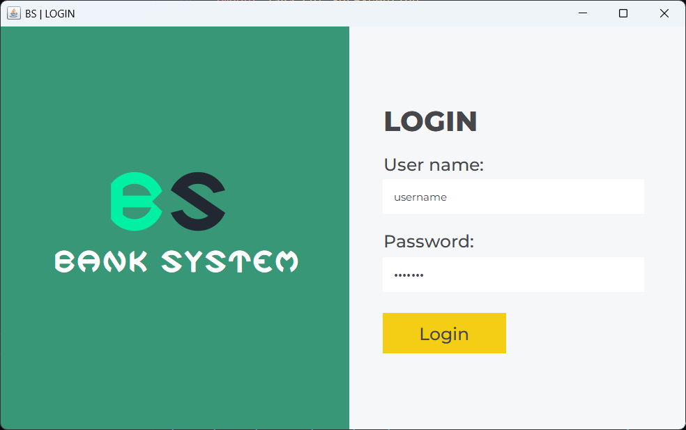
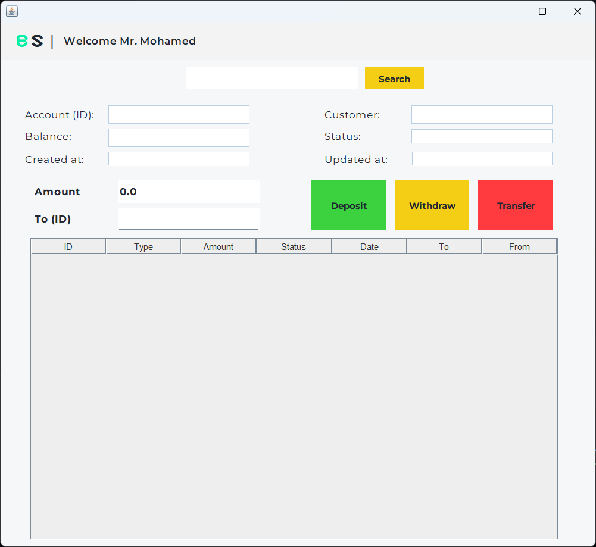
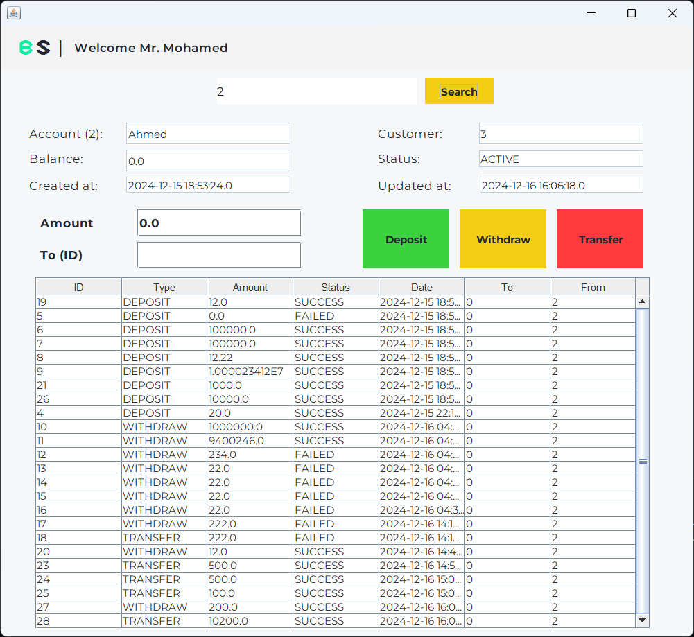
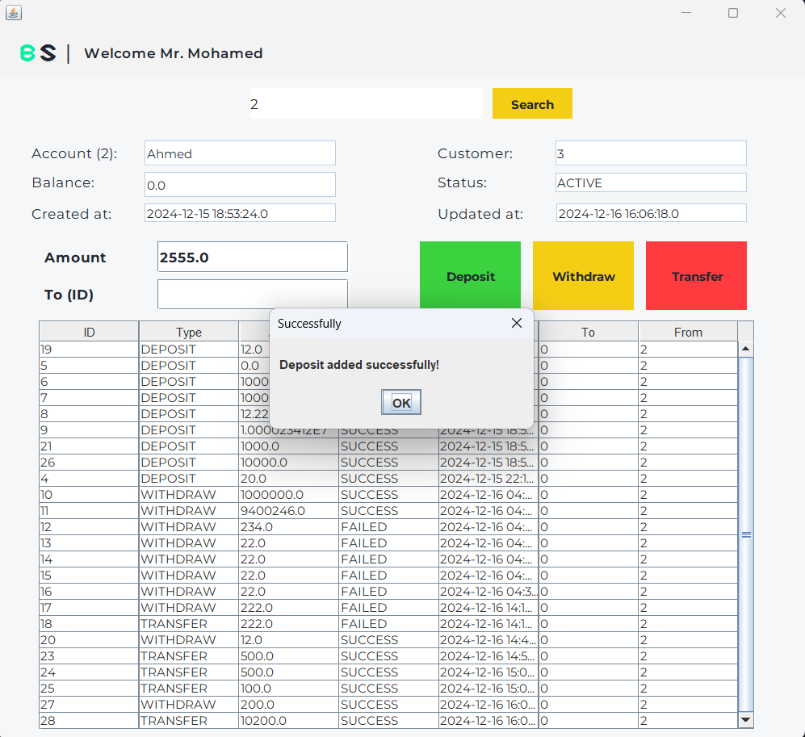
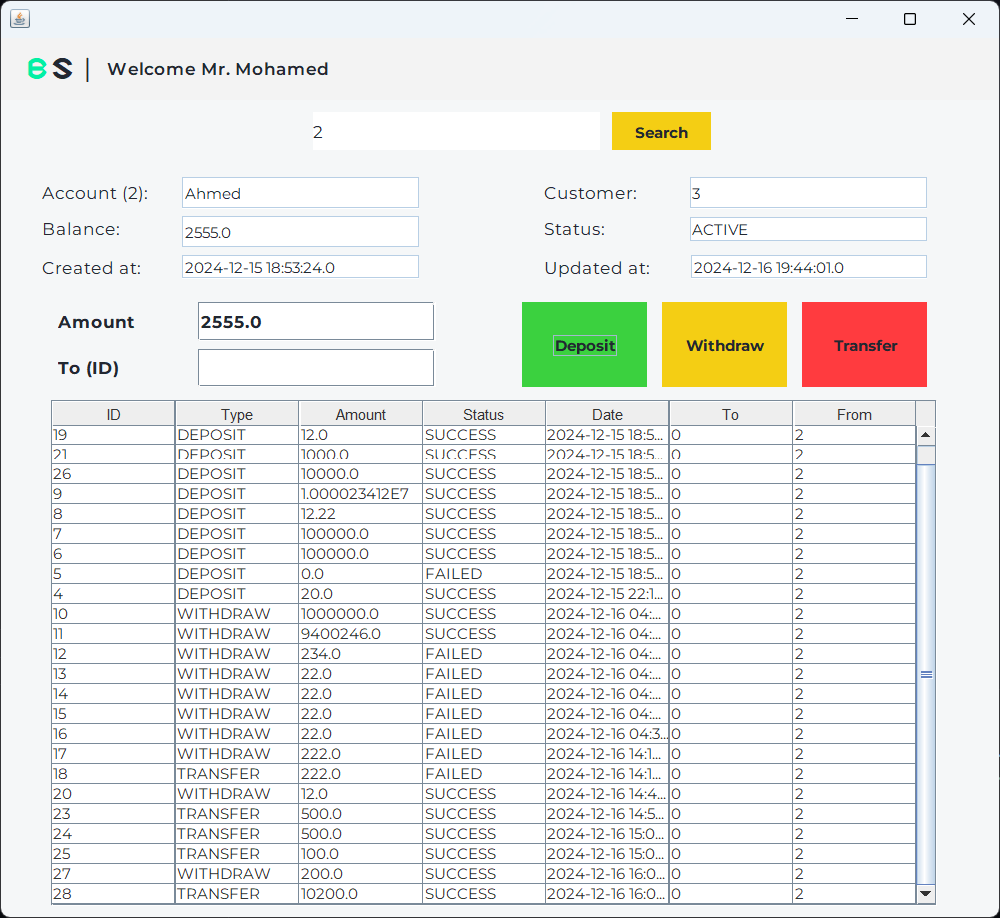
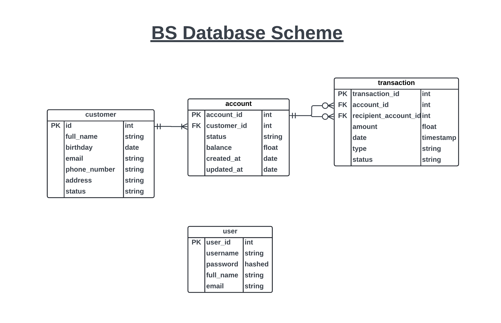
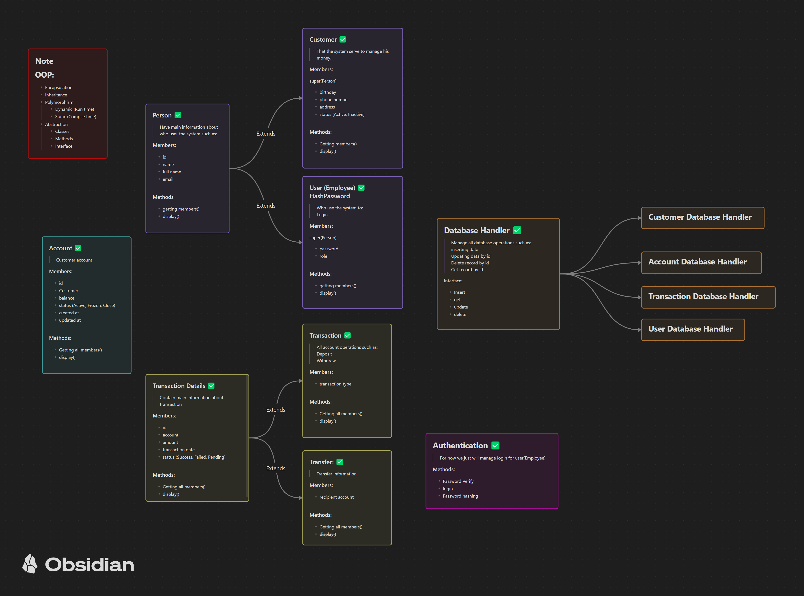

# Banking System 

A simple banking system task for university that implements main operations such as deposit, withdrawal, and transfer.

The university requirements were just to implement OOP in a real-world program, so I wanted to try out the things I learned before. Actually, it's my first time writing Java code, so if you have any feedback, I would love to hear it.

## Screenshots
| Login Window | Main Window | Get Account | Deposit | Result  |
| ------------- | ----------- | ----------- | ------- | ------ |
|  |  |  |  |  |

### Database


### Simple Graph to Explain Code Structure


### C4 Model
I tried to make one; it's my first time, so I think it's not good enough. :)
Take a look at it and tell me what you think ❤️

[c4-model.pdf](./__Screenshots/c4-model.pdf)

---

### Prerequisites
    - jdk-23
    - mysql

### Installation
First, you need to make sure that JAVA_HOME is set in your system environment (Google it if you're unsure). Then:

Clone this repository to your local machine:

```bash
git clone https://github.com/ahmedhosam-dev/base-back.git
```

#### Maven Dependencies
Build Maven with these dependencies:
```xml
<!-- For .env file -->
<dependency>
    <groupId>io.github.cdimascio</groupId>
    <artifactId>dotenv-java</artifactId>
    <version>3.0.0</version>
</dependency>

<!-- For MySQL connection -->
<dependency>
    <groupId>mysql</groupId>
    <artifactId>mysql-connector-java</artifactId>
    <version>9.1.0</version>
</dependency>

<!-- For hashing passwords -->
<dependency>
    <groupId>org.mindrot</groupId>
    <artifactId>jbcrypt</artifactId>
    <version>0.4</version>
</dependency>

<!-- Possibly for GUI components -->
<dependency>
    <groupId>org.netbeans.external</groupId>
    <artifactId>AbsoluteLayout</artifactId>
    <version>RELEASE230</version>
</dependency>
```

---

#### Environment Variables (.env)
Rename the `.env_example` file to `.env`, and write your database name, username, and password.

**NOTE**: Don't forget to import the `banksystem.sql` file into your database server.
```.env
DB_URL=jdbc:mysql://localhost:3306/your_database_name
DB_USER=your_username
DB_PASSWORD=your_password
```

---

### Project Structure
```
src/main/java/cbs
    - *.java -> Main classes like Account, Customer, Transaction, etc.
    - auth/  -> Manages authentication (hashing passwords, verifying passwords, login).
    - db/    -> Handles database connections and main operations such as insert, select, etc.
    - enums/ -> Custom data types like transaction types (Deposit, Withdraw, and Transfer).
    - gui/   -> Contains all GUI components.
/
    - banksystem.sql -> Database schema.
    - ...
```

---
### Contributing

Feel free to fork this repository and submit pull requests. For major changes, please open an issue to discuss what you would like to change.

### Contact

If you have any questions or issues, please open an issue on this repository or contact [ahmedhosam.dev@gmail.com](mailto:ahmedhosam.dev@gmail.com).
